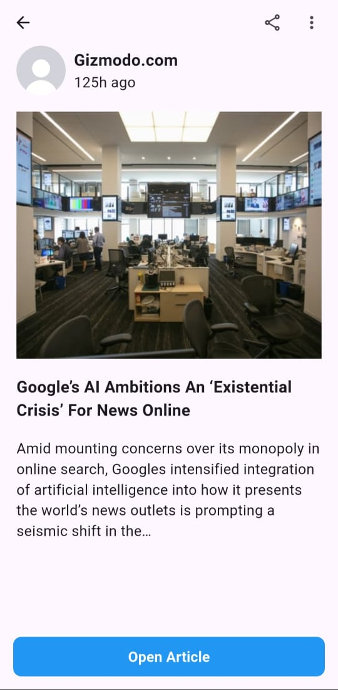

# News Application

Developed a News Application with a clean architecture using BLoC and News API.

## Application Features

- Simple UI screens.

- OnBoarding screens.
  
- Login screen.
  
- Bottom navigation bar to switch between screens easily.
  
- Home screen that contains:
    
  Categories Filter.
  
  List of News according to the category.

- Explore screen that contains searching for articales by keywords
  
- Bookmark screen that contains Bookmarked Articles

- Profile screen that contains user's information to be updated and logout button.

- Detail screen that contains article's title, image, description, published date, and a button to navigate to real full article.
  
    

## Screenshots
  

  
  
  

  

  
  
  

  

  
  
  
</p3
3
